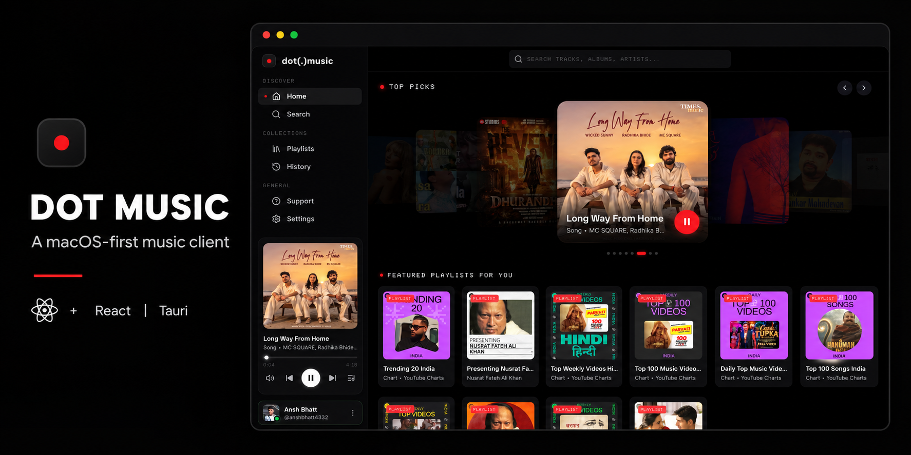

# DOT Music



**DOT Music is a macOS-first desktop music client that gives YouTube Music discovery a focused, personal library experience.** It combines a custom React interface with a Tauri desktop shell and the YouTube IFrame Player API, so the application owns the browsing and playback experience while YouTube remains responsible for media delivery.

> Built as a product exploration of what a calmer, more intentional desktop music library can feel like.

## Product Vision

Music players should feel like libraries, not crowded feeds. DOT Music is designed around fast discovery, readable collections, strong artwork, and playback controls that stay out of the way until they are needed.

The current experience is built for macOS first, with a technical foundation that can later support Windows, Linux, Android, and additional approved music sources.

## What You Can Do Today

- Search YouTube Music tracks and playlists from a custom desktop interface.
- Browse recommendation shelves and open playlist details.
- Play, pause, seek, and move between tracks through a persistent player.
- Use high-resolution artwork where it is available.
- Keep recent searches locally for faster rediscovery.
- Optionally connect a YouTube Music account for personalized library content.
- Run the same React interface in a browser for UI development.

## Product Principles

1. **Music first**: artwork, title, artist, and controls should always be easy to scan.
2. **Native where it matters**: use Tauri for desktop integration while keeping product UI flexible in React.
3. **Respect the source**: DOT Music does not host music files or bypass content restrictions. Playback availability remains subject to YouTube's embedding and rights rules.
4. **Build for expansion**: separate the UI, playback controls, data contracts, and native commands so additional supported sources can be evaluated later.

## How It Works

```text
React interface
  -> Tauri commands for desktop search and library data
  -> normalized track and playlist data
  -> YouTube IFrame Player API for playback
  -> player events synchronized back into React state
```

The visible player is DOT Music's UI. The hidden YouTube player is the playback engine: it supplies the real playback state, current time, duration, and error events.

## Tech Stack

| Layer | Technology |
| --- | --- |
| Desktop application | Tauri 2 |
| Frontend | React 19, TypeScript, Vite |
| Native layer | Rust |
| Icons | Lucide React |
| Playback | YouTube IFrame Player API |
| Data and artwork | YouTube Music endpoints and YouTube image CDN |

## Local Development

### Prerequisites

- Node.js 20 or newer
- Rust toolchain
- Xcode Command Line Tools on macOS

### Run in the browser

```bash
npm install
npm run dev
```

### Run as the desktop app

```bash
npm run tauri dev
```

### Validate a production build

```bash
npm run build
npm run lint
cargo check --manifest-path src-tauri/Cargo.toml
```

## Current Scope

DOT Music is an active personal product project, not a production streaming service. Account connection, persistent session handling, source reliability, desktop packaging, and cross-platform support are still evolving. Do not treat it as a replacement for official music-provider clients.

## Roadmap

- Refine the now-playing and queue experience.
- Strengthen account-session security with platform credential storage.
- Improve search resilience and artwork loading performance.
- Add a macOS companion surface, including an exploration of notch-aware interactions.
- Evaluate Android support with a mobile-first navigation and playback design.
- Introduce a source abstraction for local music and future licensed provider integrations.

## Author

**Ansh Bhatt**

Full-stack developer and builder of DOT Music

Email: [anshbhatt140@icloud.com](mailto:anshbhatt140@icloud.com)

## Acknowledgements

DOT Music uses the YouTube IFrame Player API for playback. YouTube and YouTube Music are trademarks of their respective owners. DOT Music is an independent project and is not affiliated with or endorsed by YouTube or Google.
